
<h1 align="center">基于web的农产品质量安全检测网站设计与实现+vue</h1>

## 简介
农产品质量安全检测网站：具备导航功能，支持产品追溯、论坛、留言板、公告及个人中心管理，提供信息查询、用户交互和后台管理等多种功能模块。    --计算机毕业设计源码；毕设源码；java毕业设计源码

## 联系方式

<h3 align="center">获取完整代码与数据库文件 + 微信：deepguan QQ: 86050149 QQ群: 783742310</h3>

<h3 align="center">可帮忙远程部署 包运行成功！提供远程部署、修改代码、设计文档指导、代码讲解等服务！</h3>

## 功能介绍（完整见运行截图）
管理员：管理员能访问系统的后台管理模块，主要负责管理公告、用户信息、产品追溯和基础数据。在管理界面中，管理员可以执行新增、查看详情、修改和删除操作。此外，管理员页面还包含个人中心功能，支持修改个人信息和退出登录。

用户：用户通过网站的首页可以访问各模块，包括产品追溯、论坛、留言板和公告。用户可以在个人中心查看并更新个人信息，如头像、手机号码和邮箱。用户可在论坛中发帖和评论，在留言板上提交意见，并通过产品追溯功能查询农产品的质量信息。

访客：访客能在首页查看网站提供的基本信息和导航栏的链接，包括论坛、公告和产品追溯入口。虽然不能通过个人中心功能进行信息修改，但可以浏览公告内容和论坛帖子，了解农产品安全检测的相关资讯与讨论。

## 运行截图
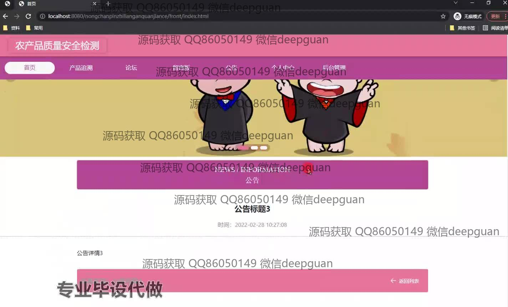
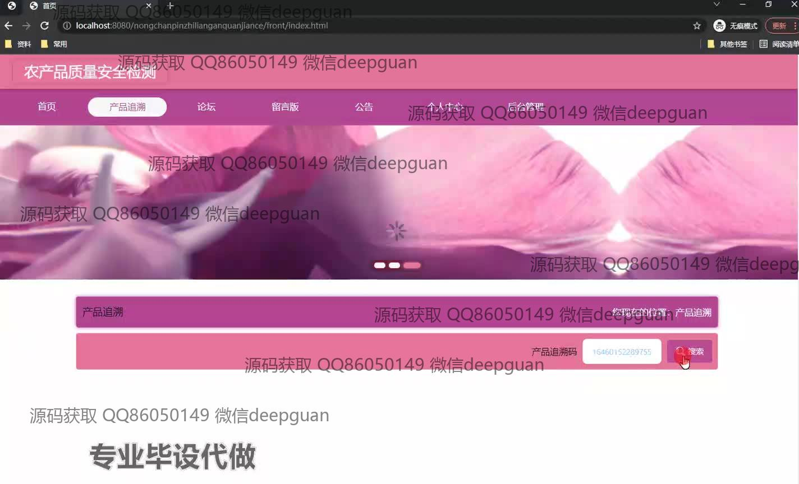
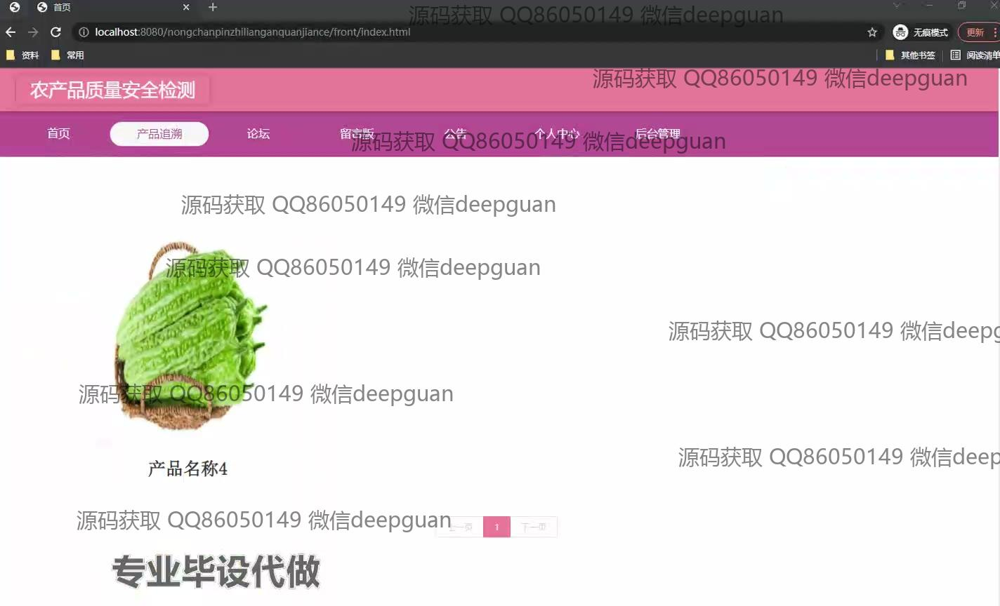
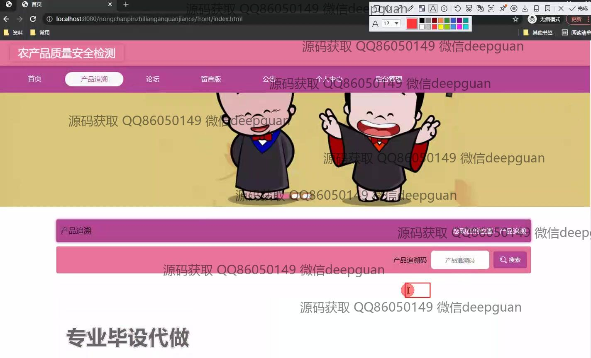
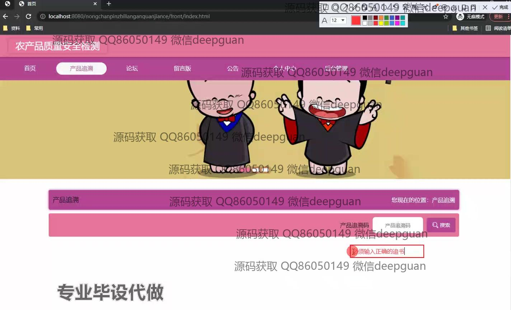
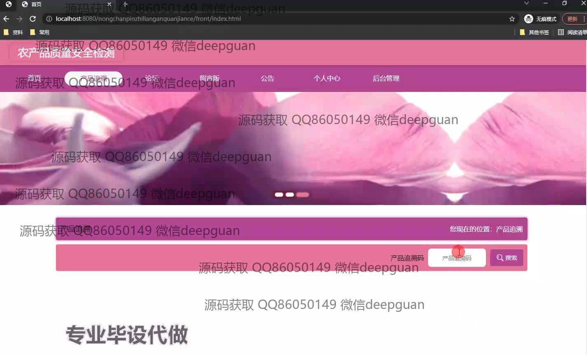
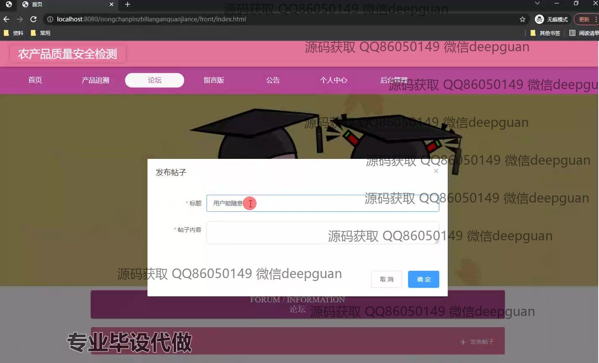
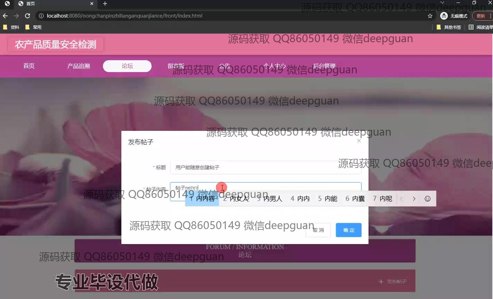
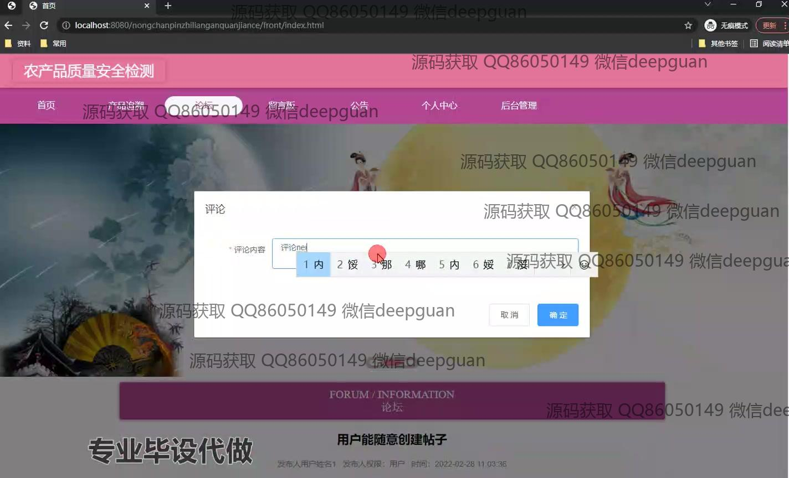
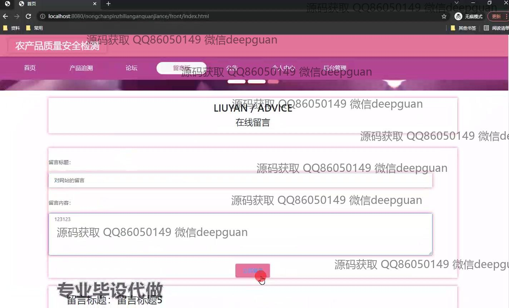
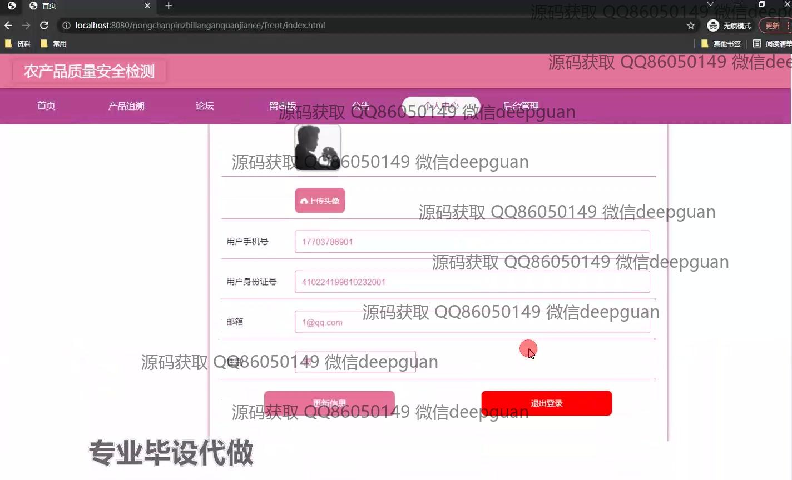
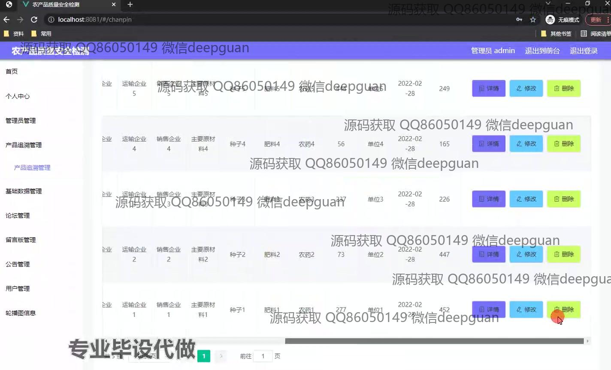
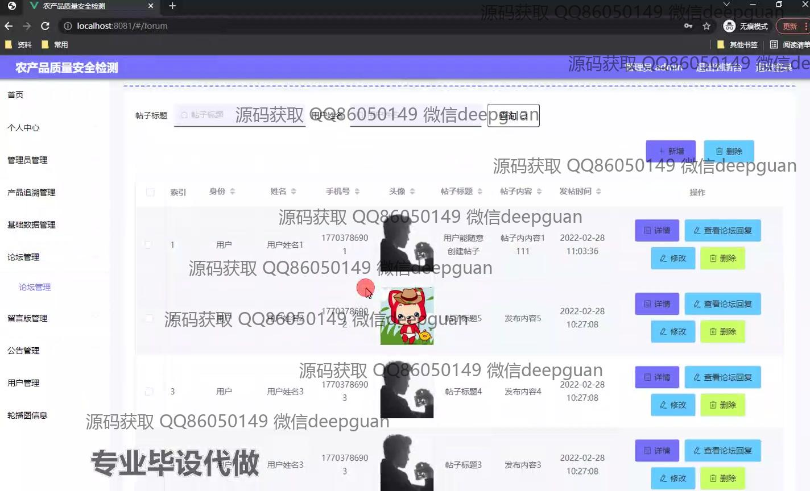
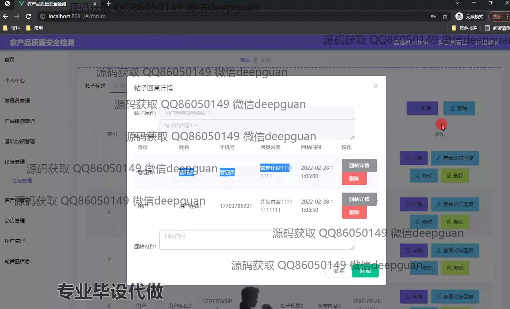
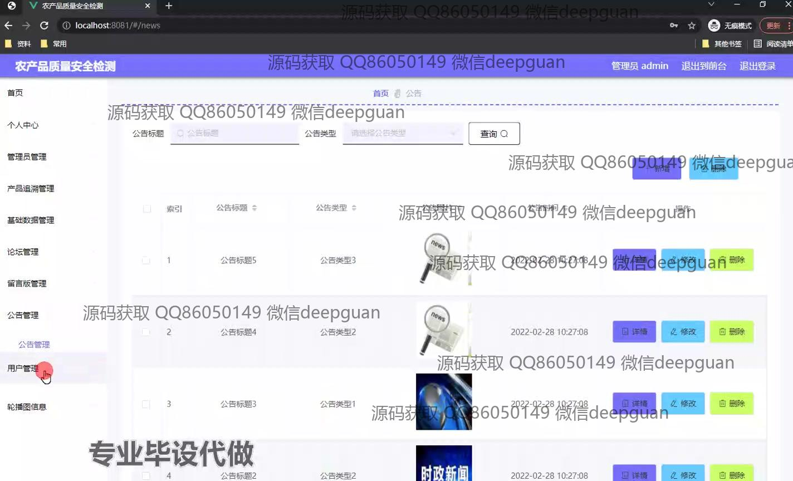

本代码来源于网络,仅供学习参考使用!

